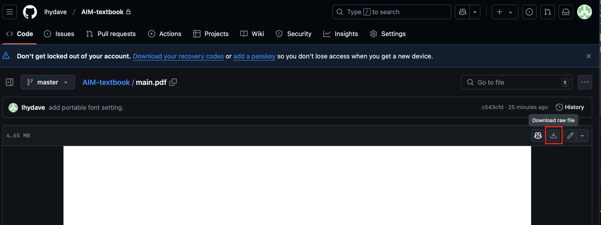
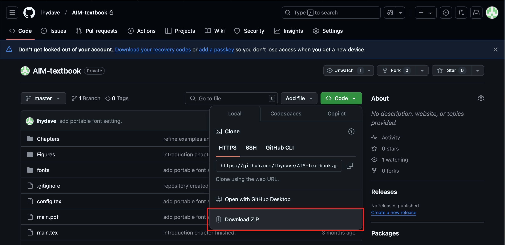
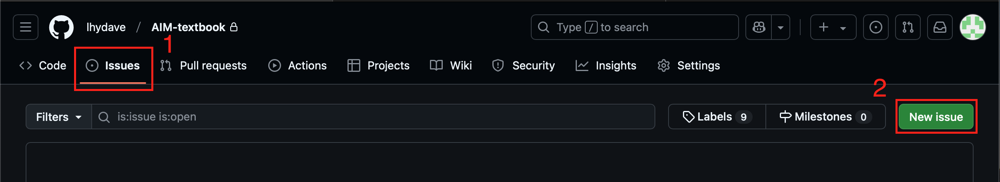
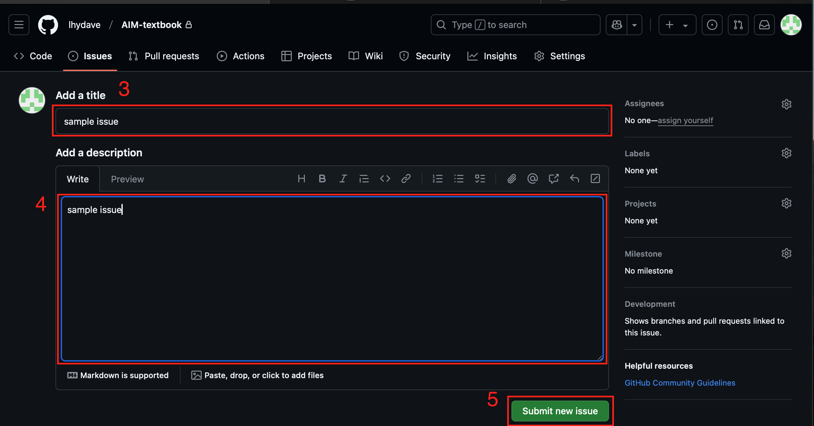

# 《AI 中的数学》教科书

本仓库包含《AI 中的数学》教科书的源代码、图像文件和 pdf 文件。

## 下载最新版的 pdf 文件

首先，点击[这里](main.pdf)，然后点击下图中的按钮即可下载。



## 下载本书的源代码

你可以下载本书的源代码，然后自己编译本书。本 README 提供最简单的一种方法，即下载压缩包。你可以按照下图所示的方法下载本书源代码的压缩包，即在本页面上点击“Code”按钮，然后点击“Download ZIP”按钮。



## 在本地编译本书

如果你希望在本地编译本书以生成 PDF 格式的电子书，你需要安装一些必要的工具。以下是详细的步骤：

### 安装 LaTeX

本书使用 LaTeX 进行排版，因此你需要安装 LaTeX。你可以通过[官网](https://www.latex-project.org/get/#tex-distributions)来安装 LaTeX。

### 编译本书

有很多方式可以编译本书，你可以使用图形化的 LaTeX 编辑器，也可以使用命令行工具。因为不同的图形化 LaTeX 编辑器操作方式不同，这里只介绍命令行工具的使用方法。

1. 首先，在命令行中进入本书的根目录。

2. 然后，运行以下命令：
```bash
latexmk main.tex --xelatex
```

3. 等待编译完成，你就可以在 `main.pdf` 中看到本书的内容了。

## 向本书提出勘误和修改提议

如果你发现本书中的错误，或者有更好的写作或修改建议，欢迎提出。由于本书采用 GitHub 仓库的模式进行管理，你可以通过 Issue 和 Pull Request 两种方式提出勘误和修改提议。

### 通过 Issue 提出勘误和修改提议

*在使用 Issue 提交建议之前，请仔细查阅 [Issue 规范](issue-format.md)，否则你的 Issue 可能会被忽略或关闭。*

1. 在本网页中，点击 `Issues` 标签。
2. 点击 `New issue` 按钮。



3. 在 `Title` 中输入勘误或修改提议的标题。
4. 在 `Write` 中输入勘误或修改提议的详细内容，请具体到章节和页码，可以附上图片，数学请使用 LaTeX 公式。
5. 点击 `Submit new issue` 按钮。



## 通过 Pull Request 提交勘误和修改提议

使用 Pull Request 提交勘误和修改提议，可以直接修改源代码，因此是一种更加直接的方式。不过 Pull Request 有相对复杂的流程，我们这里不展开介绍。有需要的读者可以参阅[这篇博客](https://blog.csdn.net/m0_62993379/article/details/144177777)。

也欢迎大家通过 Pull Request 来修复其他人在 Issue 中提出的问题，这种情况下，请引用一下对应的 Issue 编号。